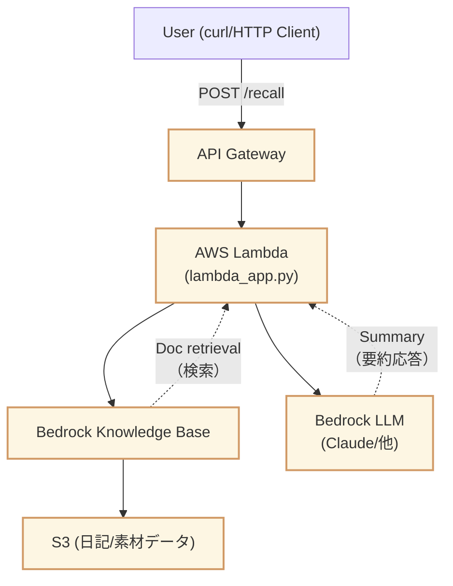
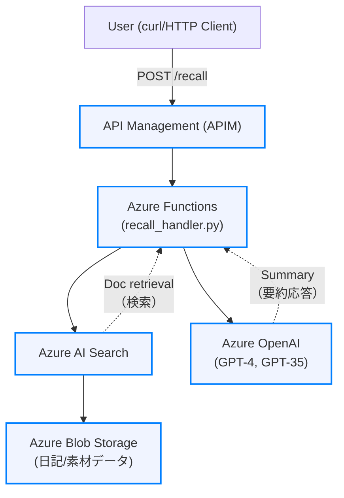

# Recall API - Personal Reflection RAG Serverless API

> **Summary:**  
> RAGとOpenAIを活用した「個人の知識リフレクションAPI」PoC。クラウドストレージに置いたファイルを元に、ブログを自動生成するための振り返りAPI（最小サーバーレス構成）。
> AWSでは `S3 + KnowledgeBase + Bedrock + Lambda + API Gateway`
> Azureでは `BlobStorage + AI Search + Azure Functions(Container Apps) + API Management` という構成を取る。
>  ※本リポジトリはAWS/AzureいずれでもRAG APIのPoC・本番構成に展開可能です。

---

## アーキテクチャ概要

AWS RAG

- **API Gateway**（/recall, POST）  
  ↓  
- **Lambda**（Python, LangChain, Bedrock連携, RAG推論）  
  ↓  
- **Bedrock Knowledge Base**（個人の記録/日記/ノート）  
  ↓  
- **Bedrock LLM**（Claude 3/3.5/Haiku等）



Azure RAG

- **API Management or Azure Functions**（HTTPトリガー）
  ↓  
- **Azure Functions(Container Apps)**（Python: recall_handler.py）
  ↓  
- **Azure AI Search**（Vector Search + チャンク検索）
  ↓  
- **Azure OpenAI**（GPT-4, GPT-35）
  ↓  
- **Azure Blob Storage**（元データ保管）



## セットアップ & デプロイ手順

AWS版:

### 1. 必要パッケージ

```bash
pip install -r infra/requirements.txt
# sam cli（未インストールなら）
brew install aws/tap/aws-sam-cli
```

### 2. AWSリソース準備（初回のみ）

- BedrockでKnowledgeBase作成し、KnowledgeBaseIdを控える
- モデルID (ModelId) を確認（例: anthropic.claude-3-haiku-20240307-v1:0）

### 3. デプロイ

```bash
sam build
sam deploy --guided \
--stack-name recall-api-stack \
--parameter-overrides \
    KnowledgeBaseId=<YourKBID> \
    ModelId=<YourModelID>
```

### 4. エンドポイント情報取得

- AWSコンソール API Gateway → Stages → Prod → Invoke URLを確認

### 5. API利用

#### API仕様

```bash
POST https://<api-id>.execute-api.ap-northeast-1.amazonaws.com/Prod/recall
Content-Type: application/json
{
"query": "ここ１週間のクライミングのハイライトは？"
}
```

##### Request例

```bash
curl -X POST "https://<api-id>.execute-api.ap-northeast-1.amazonaws.com/Prod/recall" \
-H "Content-Type: application/json" \
-d '{"query": "ここ１週間のクライミングのハイライトは？"}'
```

##### Response例

```json
{
"summary": "ここ1週間のクライミングのハイライトは以下の通りです: ..."
}
```

Azure版:

### 1. Azureリソース準備（初回のみ）

- Azure Blob Storage（元データ保管用）を作成し、コンテナー名/ストレージ名を控える
- Azure AI Search（旧Cognitive Search）でIndexを作成し、Index名を控える
- Azure OpenAIリソースを作成し、デプロイ（Standard）でデプロイ名を控える
- 必要に応じてAPI ManagementやFunctionsのリソース名やエンドポイントも控えておく

### ローカル動作・セットアップ

Azure Functionsによるローカル開発・起動手順は  
[infra/azure/Readme.md](infra/azure/Readme.md) に詳しく記載しています。  
※環境変数やローカル起動、テストのcurl例も掲載

> [Azure公式ガイド](https://learn.microsoft.com/ja-jp/azure/azure-functions/functions-run-local) も随時参照してください。
