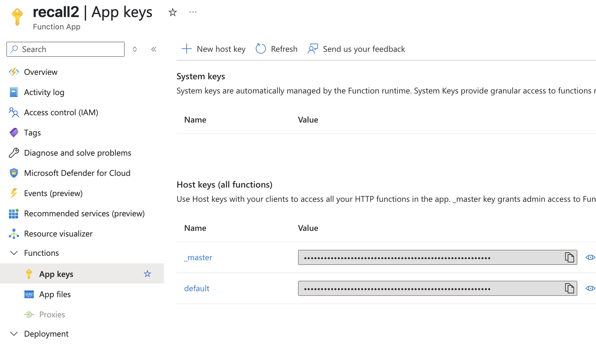

# Recall API - Personal Reflection RAG Serverless API

> **Summary:**  
> RAGとOpenAIを活用した「個人の知識リフレクションAPI」PoC。クラウドストレージに置いたファイルを元に、ブログを自動生成するための振り返りAPI（最小サーバーレス構成）。
> AWSでは `S3 + KnowledgeBase + Bedrock + Lambda + API Gateway`
> Azureでは `BlobStorage + AI Search + Azure Functions(App Service)` という構成を取る。
> ※ 一部、証拠付き応答(source返し)を盛り込んでいる(Azure側)

## Why / 背景・目的

* 「個人の記録（ジャーナル・日記・日報・メモ）から、“あとで振り返る” を自動化したい」
* ChatGPT等で“日々の気づき”をAIで整理したいが、**「どの記録から、どう答えを引くか」**の仕組みまで作り込みたい
* エンジニア・研究者・知識労働者の「知的生産の棚卸し」を、RAG＋クラウドAIで最小工数・安価にサーバレス化したかった

---

## アーキテクチャ概要

AWS RAG

- **API Gateway**（/recall, POST）  
  ↓  
- **Lambda**（Python, LangChain, Bedrock連携, RAG推論）  
  ↓  
- **Bedrock Knowledge Base**（個人の記録/日記/ノート）  
  ↓  
- **Bedrock LLM**（Claude 3/3.5/Haiku等）


Azure RAG

- **Azure Functions(App Service)**（HTTPトリガー）
  ↓  
- **Azure AI Search**（Vector Search + チャンク検索）
  ↓  
- **Azure OpenAI**（GPT-4, GPT-35）
  ↓  
- **Azure Blob Storage**（元データ保管）


## セットアップ & デプロイ手順

---

AWS版:

### 1. 必要パッケージ

```bash
pip install -r infra/requirements.txt
# sam cli（未インストールなら）
brew install aws/tap/aws-sam-cli
```

### 2. AWSリソース準備（初回のみ）

- BedrockでKnowledgeBase作成し、KnowledgeBaseIdを控える
- モデルID (ModelId) を確認（例: anthropic.claude-3-haiku-20240307-v1:0）

### 3. デプロイ

```bash
sam build
sam deploy --guided \
--stack-name recall-api-stack \
--parameter-overrides \
    KnowledgeBaseId=<YourKBID> \
    ModelId=<YourModelID>
```

### 4. エンドポイント情報取得

- AWSコンソール API Gateway → Stages → Prod → Invoke URLを確認

### 5. API利用

#### API仕様

```bash
POST https://<api-id>.execute-api.ap-northeast-1.amazonaws.com/Prod/recall
Content-Type: application/json
{
"query": "ここ１週間のクライミングのハイライトは？"
}
```

##### Request例

```bash
curl -X POST "https://<api-id>.execute-api.ap-northeast-1.amazonaws.com/Prod/recall" \
-H "Content-Type: application/json" \
-d '{"query": "ここ１週間のクライミングのハイライトは？"}'
```

##### Response例

```json
{
"summary": "ここ1週間のクライミングのハイライトは以下の通りです: ..."
}
```

---

Azure版:

### 1. Azureリソース準備（初回のみ）

- Azure Blob Storage（元データ保管用）を作成し、コンテナー名/ストレージ名を控える
- Azure AI Search（旧Cognitive Search）でIndexを作成し、Index名を控える
- Azure OpenAIリソースを作成し、デプロイ（Standard）でデプロイ名を控える
- Function App(App Service) を作成する。portalにて環境変数設定を行い、クライアントからのリクエストに必要な、エンドポイントURLやkeyの情報の情報を取得する

### 2.ローカル動作・セットアップ

Azure Functionsによるローカル開発・起動手順は  
[infra/azure/Readme.md](infra/azure/Readme.md) に詳しく記載しています。  
※環境変数やローカル起動、テストのcurl例も掲載

### 3. 本番環境へのディプロイ

ローカルでの開発や動作確認ができたら、ディプロイを行う

```bash
 func azure functionapp publish <your-app-name> 
```

### 4. 本番環境の 環境変数設定、エンドポイント情報,Keyを取得

* 環境変数設定

Secretは Portal にて環境変数を設定する : [Settings] -> [Environment variables]


※ 本番環境ではローカルと異なり、local_setting.jsonには記載しない（アップロードもしない）

* エンドポイント情報取得

リクエスト時に必要となるEndpoint(Appname)を控えておく（下記）
: [Overview] -> [Default domain]


* FunctionKeyを取得

リクエスト時に必要となるFunctionKeyを控えておく（下記）: [Functions] -> [App keys]



### 5. API利用

#### API仕様

```bash
POST https://<your-app-name>.azurewebsites.net/api/function_app?code=<your-function-key>
Content-Type: application/json
{
"query": "ここ１週間のクライミングのハイライトは？"
}
```

##### Request例

```bash
curl -X POST "https://<your-app-name>.azurewebsites.net/api/function_app?code=<your-function-key>" \
-H "Content-Type: application/json" \
-d '{"query": "ここ１週間のクライミングのハイライトは？"}'
```

  ※ code には、portalより取得した function keyを指定する

##### Response例

```json
{"summary": "昨日のクライミングセッションで、指が回復したことで高強度の課題であるV7とV8を多くトライしました。V7を２つほどクリアでき、V8でも手応えを感じる進歩がありました。", "sources": [{"content": "# 2025-05-28\n\n昨日は、指が回復したので高強度のもの V7, V8 を多くトライ.\nそのうちv7を２つほど落とせ、v8も手応えのある進捗を得た\n", "filename": "2025-05-28.txt", "url": "aHR0cHM6Ly93ZWF2aWN0ZXN0LmJsb2IuY29yZS53aW5kb3dzLm5ldC9yYXcvMjAyNS0wNS0yOC50eHQ", "date": "2025-05-29T03:54:47Z"}]}
```


> [Azure公式ガイド](https://learn.microsoft.com/ja-jp/azure/azure-functions/functions-run-local) も随時参照してください。
