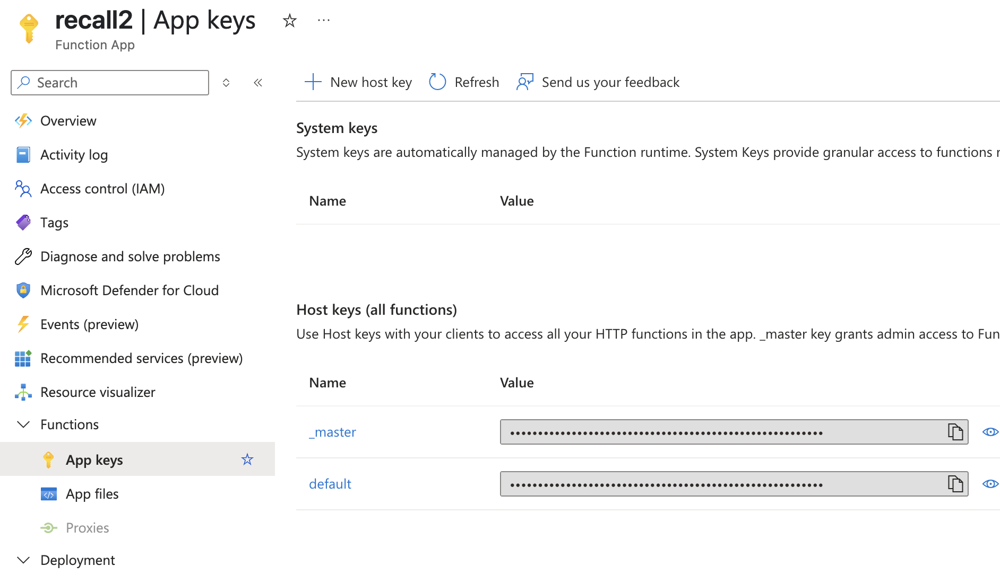

# Azure Functions (Python) 開発・起動手順

1. Azure Functions Core Toolsのインストール

（Homebrew例／他は公式ガイド参照）

```bash
brew tap azure/functions
brew install azure-functions-core-tools@4
# or
npm i -g azure-functions-core-tools@4 --unsafe-perm true
```

2. プロジェクトディレクトリ作成 & 初期化

```bash
cd infra/azure/
func init . --python
```

• 既存プロジェクトに追加する場合はこのステップは省略可

3. Function 作成（例: HTTPトリガー）

```bash
func new --name function_app --template "HTTP trigger" --authlevel "function"
```

4. 依存ライブラリのインストール

• またはグローバル/venvでインストール

```bash
python3 -m venv .venv 
source .venv/bin/activate
pip install -r function_app/requirements.txt
```

```bash
pip install -r function_app/requirements.txt
```

5. local.settings.jsonの作成（環境変数セット）

• 必要な環境変数（APIキーやエンドポイント等）を function_app/local.settings.json か infra/azure/local.settings.jsonに記入
• 例:

```bash
{
  "IsEncrypted": false,
  "Values": {
    "FUNCTIONS_WORKER_RUNTIME": "python",
    "AZURE_OPENAI_ENDPOINT": "https://xxxx.openai.azure.com",
    "AZURE_OPENAI_API_KEY": "sk-...",
    "AZURE_OPENAI_DEPLOYMENT": "your-deployment-name",
    "AZURE_SEARCH_ENDPOINT": "https://xxxx.search.windows.net",
    "AZURE_SEARCH_API_KEY": "qn....",
    "AZURE_SEARCH_INDEX": "your-index-name"
  }
} 
```

6. ローカルで起動（HTTPサーバ起動）

```bash
func start
```
infra/azure にて func start

• http://localhost:7071/api/function_app でAPIが立ち上がる

• ログに「Function Runtime Version」や「[POST] http://localhost:7071/api/function_app」と表示されれば成功

7. curl等で動作確認

* request

```bash
curl -X POST "http://localhost:7071/api/function_app" \
-H "Content-Type: application/json" \
-d '{"query": "ここ1週間のクライミングのハイライトは？"}'
```

* response
  
```json
{"summary": "ここ1週間のクライミングのハイライトは、昨日指が回復して高強度の課題であるV7とV8をトライし、V7を2つ落とすことができたことと、V8でも手応えのある進捗を得たことです。", "sources": [{"content": "# 2025-05-28\n\n昨日は、指が回復したので高強度のもの V7, V8 を多くトライ.\nそのうちv7を２つほど落とせ、v8も手応えのある進捗を得た\n", "filename": "2025-05-28.txt", "url": "aHR0cHM6Ly93ZWF2aWN0ZXN0LmJsb2IuY29yZS53aW5kb3dzLm5ldC9yYXcvMjAyNS0wNS0yOC50eHQ", "date": "2025-05-29T03:54:47Z"}]}
```

※ source返しが確認できる

8. ディプロイを行い、本番環境で確認する

ディプロイを行う

```bash
 func azure functionapp publish <your-app-name> 
```

* （初回のみ）環境変数を設定する : [Settings] -> [Environment variables]
  


※ 本番環境ではローカルと異なり、local_setting.jsonには記載しない（アップロードもしない）
  
curlで確認を行う

* request

```bash
curl -X POST "https://<your-app-name>.azurewebsites.net/api/function_app?code=<your-function-key>" \
                -H "Content-Type: application/json" \
                -d '{"query": "ここ1週間のクライミングのハイライトは？"}'
```

  ※ code には、azure portalにある keyを指定する（下記）: [Functions] -> [App keys]



* response

```json
{"summary": "昨日のクライミングセッションで、指が回復したことで高強度の課題であるV7とV8を多くトライしました。V7を２つほどクリアでき、V8でも手応えを感じる進歩がありました。", "sources": [{"content": "# 2025-05-28\n\n昨日は、指が回復したので高強度のもの V7, V8 を多くトライ.\nそのうちv7を２つほど落とせ、v8も手応えのある進捗を得た\n", "filename": "2025-05-28.txt", "url": "aHR0cHM6Ly93ZWF2aWN0ZXN0LmJsb2IuY29yZS53aW5kb3dzLm5ldC9yYXcvMjAyNS0wNS0yOC50eHQ", "date": "2025-05-29T03:54:47Z"}]}
```
 
## 参考

[Azure公式ガイド](https://learn.microsoft.com/ja-jp/azure/azure-functions/functions-run-local) 参照

### AI Searchでの blobの metadata 取得設定

運用観点で
Azureの AI Searchのインデックス、インデクサーで、metadata のfileMapping を設定しメタデータを取得できるようにしておく ( edit json )

例(indexers):

```json
    "fieldMappings": [
        {
        "sourceFieldName": "metadata_storage_path",
        "targetFieldName": "metadata_storage_path",
        "mappingFunction": {
            "name": "base64Encode",
            "parameters": {
            "useHttpServerUtilityUrlTokenEncode": false
            }
        }
        },
        {
        "sourceFieldName": "metadata_storage_name",
        "targetFieldName": "metadata_storage_name",
        "mappingFunction": null
        },
        {
        "sourceFieldName": "metadata_storage_last_modified",
        "targetFieldName": "metadata_storage_last_modified",
        "mappingFunction": null
        }
    ],
```

例(index)：

```json
    {
      "name": "metadata_storage_last_modified",
      "type": "Edm.DateTimeOffset",
      "searchable": false,
      "filterable": false,
      "retrievable": true,
      "stored": true, <-
      "sortable": false,
      "facetable": false,
      "key": false,
      "synonymMaps": []
    },
    {
      "name": "metadata_storage_path",
      "type": "Edm.String",
      "searchable": false,
      "filterable": false,
      "retrievable": true, <-
      "stored": true,
      "sortable": false,
      "facetable": false,
      "key": true,
      "synonymMaps": []
    },
    {
      "name": "metadata_storage_name",
      "type": "Edm.String",
      "searchable": false,
      "filterable": false,
      "retrievable": true, <-
      "stored": true,
      "sortable": false,
      "facetable": false,
      "key": false,
      "synonymMaps": []
    },
```
