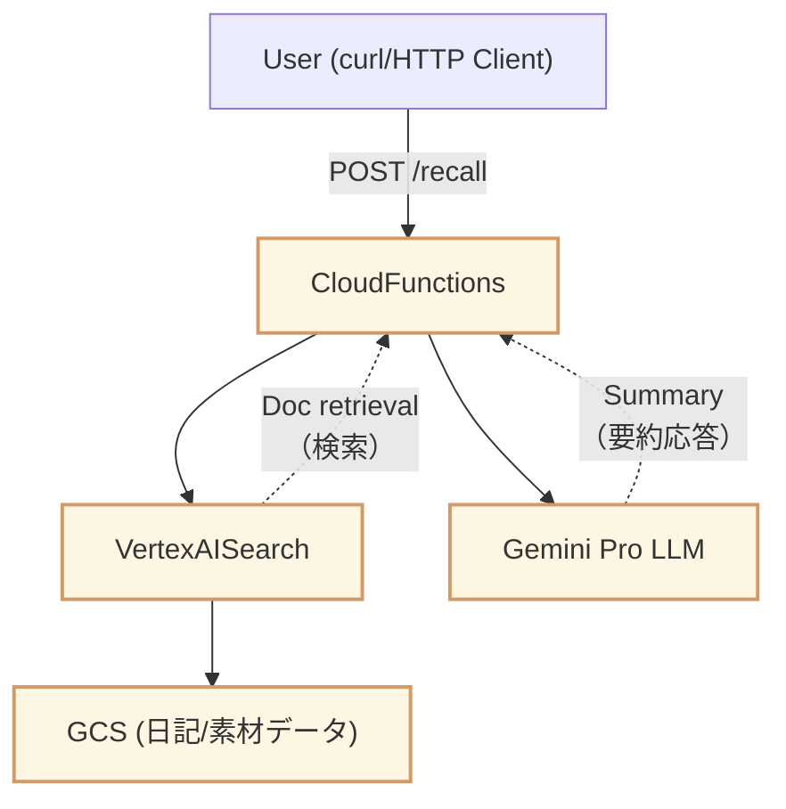

このブランチは GCPでも、AWS、Azureと同様にLangChainでRAG構成を実現しようとしたときの
作業ログです。下記の、GeminiLLMを呼ぶ部分が `langchain_google_vertexai import ChatVertexAI` でできないため（`Failed to generate response: 404 Publisher Model projects/<YOUR PROJECT ID>/locations/<LOCATION ID>/publishers/google/models/gemini-1.5-pro-001 was not found or your project does not have access to it.` となり利用できないため（PaLM: chat-bison同様）、一時的にGeminiのAPIをWrapし、LangChainとして利用しているもの、`429 Too Many Requests` で機能していない状態のものです。しばらく様子を見てそれでもだめであれば、modelのところだけ、OpenAIを利用するのもいいのかもしれないと考えています。
（参考: LangChain on Vertex AI (a.k.a. Reasoning Engine) , RAG Engine）



# GCP リソース準備手順

1. Vertex AI Search
2. GCS


# ローカル実行

```bash
functions-framework --target=handle_query --debug
```
